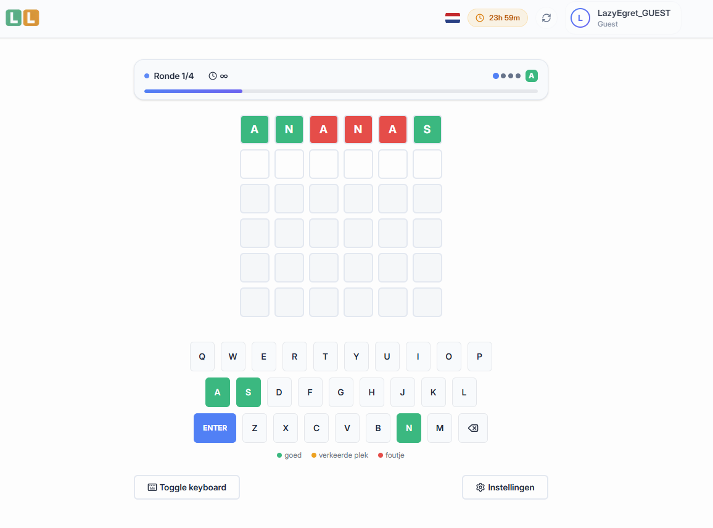

# League of Letters

**League of Letters** is a multilingual word-guessing game, with both **solo** and **real-time multiplayer** modes.  
Built with modern web technologies, it supports large scraped word lists for multiple languages.



---

## 🚀 Features

- 🎮 **Game Modes**
  - Singleplayer mode (local play with seeded word lists).
  - Online multiplayer with real-time interactions via WebSockets (Socket.io).
- 🌍 **Multilingual Support**  
  - Multiple languages with large word lists for each supported language.
- 🗄️ **Robust Infrastructure**
  - Next.js core server for server and client.
  - Express server for WebSocket connections and scheduled jobs.
  - PostgreSQL database powered by Drizzle ORM.
- 🔄 **Automated Maintenance**
  - Daily cronjobs remove expired games and guest accounts.
- 🛠️ **Developer Friendly**
  - Clear separation of core app and actions server.
  - Database migrations & seeding scripts included.
  - ESLint setup for clean and consistent code.

---

## 🏗️ Infrastructure

- **Next.js** — Core server & client app (authentication, pages, everything for solo gameplay).  
- **Express.js** — WebSocket server for real-time multiplayer + cronjobs.  
- **PostgreSQL** — Main database with Drizzle ORM for schema & migrations.  

---

## 💻 Local Development

### Prerequisites
- PostgreSQL installed locally.
- `.env` files configured for each app (based on provided `.env.example`). core_actions is only required for online games and cleanup.

### Core App (nextjs)
```bash
npm install
npm run dev
```

### Actions server
```bash
npm install
npm run start
```

### Database
```bash
npm run db:migrate
```

## Deployment
See the deploy/README.md for deployment instructions and more information regarding the hosting/deployment.

## Backlog / Roadmap
Planned and upcoming features are documented in BACKLOG.md.